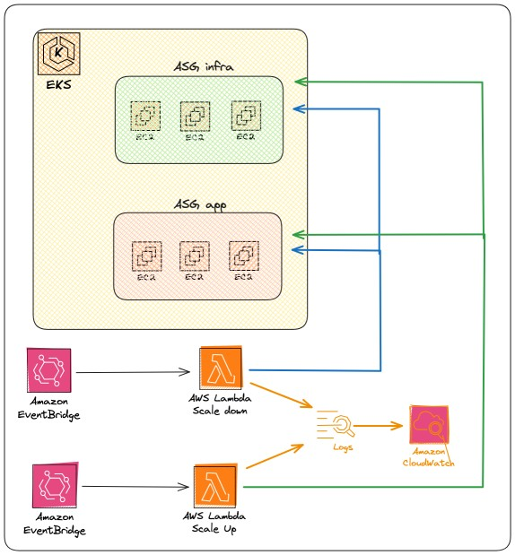

# stUTILo

Have you ever felt like you're spending too much money on your pre-production environments? Well, Stutilo is the tool for you!

Why pay for an environment you're not using? Our developers don't work at night, on weekends, or during the summer.

With a simple architecture fully described using HCL code, you'll be able to set up a tool in seconds that helps you reduce the costs of your AWS account!

Are you worried about the costs of such architecture? NO PROBLEM! This architecture costs 0, it uses the free tier of AWS Lambda, Event Bridge, and CloudWatch services!

<!--  -->
<p align="center">
  
</p>

## How much can I save with Stutilo?

Let's say we have an EKS cluster in a staging environment with the following autoscaling groups:

App: 3 nodes of size t3.large
Infra: 3 nodes of size t3.large
The cost of 6 t3.large instances on AWS is approximately 2800 euros per year (+ Taxes)
But these instances in non-production environments don't need to be running 24/7

With Stutilo, you can halve this cost!

Just configure the variables

```
# scale_down_schedule = "cron(0 19 * * ? *)"
# scale_up_schedule = "cron(0 8 ? * 2-6 *)" #scaling up from Monday to Friday at 8am
```

And with some information about your ASGs, Stutilo will be able to shut down those resources at the specified time.

With the default parameters, stUTILo can save you a whopping 13 hours of billing per day and the entire billing for weekends!

With stUTILo you can reduce your costs by up to

<p align="center">
  
</p>


<!-- BEGIN_TF_DOCS -->
## Requirements

| Name | Version |
|------|---------|
| <a name="requirement_terraform"></a> [terraform](#requirement\_terraform) | >= 1.8.0 |
| <a name="requirement_archive"></a> [archive](#requirement\_archive) | 2.4.2 |
| <a name="requirement_aws"></a> [aws](#requirement\_aws) | 5.45.0 |

## Providers

| Name | Version |
|------|---------|
| <a name="provider_archive"></a> [archive](#provider\_archive) | 2.4.2 |
| <a name="provider_aws"></a> [aws](#provider\_aws) | 5.45.0 |

## Modules

No modules.

## Resources

| Name | Type |
|------|------|
| [aws_cloudwatch_event_rule.scale_down_event](https://registry.terraform.io/providers/hashicorp/aws/5.45.0/docs/resources/cloudwatch_event_rule) | resource |
| [aws_cloudwatch_event_rule.scale_up_event](https://registry.terraform.io/providers/hashicorp/aws/5.45.0/docs/resources/cloudwatch_event_rule) | resource |
| [aws_cloudwatch_event_target.event_scale_up](https://registry.terraform.io/providers/hashicorp/aws/5.45.0/docs/resources/cloudwatch_event_target) | resource |
| [aws_cloudwatch_event_target.lambda](https://registry.terraform.io/providers/hashicorp/aws/5.45.0/docs/resources/cloudwatch_event_target) | resource |
| [aws_cloudwatch_log_group.lambda_scale_down_log_group](https://registry.terraform.io/providers/hashicorp/aws/5.45.0/docs/resources/cloudwatch_log_group) | resource |
| [aws_cloudwatch_log_group.lambda_scale_up_log_group](https://registry.terraform.io/providers/hashicorp/aws/5.45.0/docs/resources/cloudwatch_log_group) | resource |
| [aws_iam_policy.eks_nodegroup_policy](https://registry.terraform.io/providers/hashicorp/aws/5.45.0/docs/resources/iam_policy) | resource |
| [aws_iam_role.scale_role_lambda](https://registry.terraform.io/providers/hashicorp/aws/5.45.0/docs/resources/iam_role) | resource |
| [aws_iam_role_policy_attachment.aws_iam_role_policy_attachment](https://registry.terraform.io/providers/hashicorp/aws/5.45.0/docs/resources/iam_role_policy_attachment) | resource |
| [aws_lambda_alias.scale_down_alias](https://registry.terraform.io/providers/hashicorp/aws/5.45.0/docs/resources/lambda_alias) | resource |
| [aws_lambda_alias.scale_up_alias](https://registry.terraform.io/providers/hashicorp/aws/5.45.0/docs/resources/lambda_alias) | resource |
| [aws_lambda_function.function_scale_down](https://registry.terraform.io/providers/hashicorp/aws/5.45.0/docs/resources/lambda_function) | resource |
| [aws_lambda_function.function_scale_up](https://registry.terraform.io/providers/hashicorp/aws/5.45.0/docs/resources/lambda_function) | resource |
| [aws_lambda_permission.allow_cloudwatch_scale_down](https://registry.terraform.io/providers/hashicorp/aws/5.45.0/docs/resources/lambda_permission) | resource |
| [aws_lambda_permission.allow_cloudwatch_scale_up](https://registry.terraform.io/providers/hashicorp/aws/5.45.0/docs/resources/lambda_permission) | resource |
| [archive_file.function__scale_down_zip](https://registry.terraform.io/providers/hashicorp/archive/2.4.2/docs/data-sources/file) | data source |
| [archive_file.function_scale_up_zip](https://registry.terraform.io/providers/hashicorp/archive/2.4.2/docs/data-sources/file) | data source |
| [aws_autoscaling_groups.all](https://registry.terraform.io/providers/hashicorp/aws/5.45.0/docs/data-sources/autoscaling_groups) | data source |
| [aws_caller_identity.current](https://registry.terraform.io/providers/hashicorp/aws/5.45.0/docs/data-sources/caller_identity) | data source |

## Inputs

| Name | Description | Type | Default | Required |
|------|-------------|------|---------|:--------:|
| <a name="input_autoscaling_groups_info"></a> [autoscaling\_groups\_info](#input\_autoscaling\_groups\_info) | I tried to get this information from the resource inside AWS, but it's too risky to use for the scale up function | <pre>list(object({<br>    name             = string<br>    desired_capacity = number<br>    min_size         = number<br>    max_size         = number<br>  }))</pre> | n/a | yes |
| <a name="input_cluster_name"></a> [cluster\_name](#input\_cluster\_name) | The name of the EKS cluster | `string` | n/a | yes |
| <a name="input_env_name"></a> [env\_name](#input\_env\_name) | The name of the environment | `string` | n/a | yes |
| <a name="input_log_format"></a> [log\_format](#input\_log\_format) | The format of the logs | `string` | `"JSON"` | no |
| <a name="input_log_level"></a> [log\_level](#input\_log\_level) | The log level | `string` | `"INFO"` | no |
| <a name="input_log_retention_days"></a> [log\_retention\_days](#input\_log\_retention\_days) | The number of days to retain the logs | `number` | `7` | no |
| <a name="input_min_number_of_instances"></a> [min\_number\_of\_instances](#input\_min\_number\_of\_instances) | The minimum number of instances in the autoscaling group | `number` | `0` | no |
| <a name="input_region"></a> [region](#input\_region) | The AWS region | `string` | n/a | yes |
| <a name="input_scale_down_schedule"></a> [scale\_down\_schedule](#input\_scale\_down\_schedule) | The schedule for scaling down the EKS cluster | `string` | `"cron(0 19 * * ? *)"` | no |
| <a name="input_scale_up_schedule"></a> [scale\_up\_schedule](#input\_scale\_up\_schedule) | The schedule for scaling up the EKS cluster | `string` | `"cron(0 8 ? * 2-6 *)"` | no |

## Outputs

| Name | Description |
|------|-------------|
| <a name="output_autoscaling_groups"></a> [autoscaling\_groups](#output\_autoscaling\_groups) | n/a |
<!-- END_TF_DOCS -->
